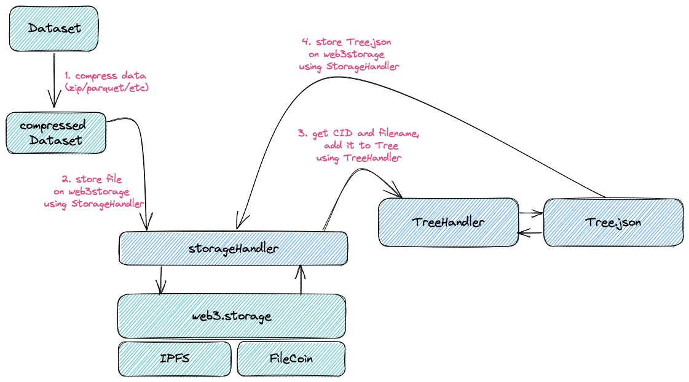

# oncohub-web3-storage

[](https://www.npmjs.com/package/oh-storage-12)

## Description

### Genesis

Data scientists without data are naked. The First idea was to store data in one of three big cloud players solutions,  like s3, blob or storage. This turned out to be too expensive for non-profit organizations, at least at the beginning (at the time when I am writing it, I'm alone). As data for those storage should be exposed for anyone (open license and anonymize), then in my head arise the idea to implement it on decentralized storage. It turned out to be much cheaper (actually only a tiny fraction of the cloud provider cost).

### Mechanics



#### Components

Storage
1. web3.storage - is a platform which facilitates access to decentralize storage. Under the hood it uses IPFS as peer-to-peer storage and filecoin as an incentive layer.
2. StorageHandler - handler which allows read and write to web3.storage.

Data presentation
1. TreeHandler - handler which allows to read, save and add branch to Tree object.
2. Tree.json - json like object which is compatible with Apache Echarts type tree.

#### Presentation layer

Because after saving data on IPFS we get CIDs and it is hard to track data structure, so we decided to create an additional layer for presenting our data. We use that tree structure as json to easily translate to Apache Echarts Tree.
After uploading a file on IPFS we collect metadata like: name, CID, size and add it to the proper branch in the Tree.
Besides, the Tree object is also saved on IPFS and thanks to that we can hold only one CID which points to our Tree with all needed metadata.

## How to install and run

Install by npm: 

`npm install oh-storage`

or using yarn:

`yarn add oh-storage`

## How to use

Example code app.ts:

```js
import * as fs from 'fs/promises';
import { storage } from 'oh-storage-12';

// @ts-ignore
const st = new storage.StorageHandler(process.env.WEB3_STORAGE_API_TOKEN);
const tr = new storage.TreeHandler();

async function createInitialTree() {
  const schema = {
    name: 'root',
    children: [
      {
        name: 'dir1',
        children: [
          { name: 'file1', children: [] },
          { name: 'file2', children: [] },
        ],
      },
      {
        name: 'dir2',
        children: [
          { name: 'file1', children: [] },
          { name: 'file2', children: [] },
        ],
      },
    ],
  };

  // save new schema to json
  await tr.save('init_tree', __dirname, schema);
}

async function addTreeToIpfs() {
  const name = await tr.getLast(__dirname);
  const { cid, size } = await st.save('./' + name);
  console.log(`Tree added to ipfs, cid: ${cid}, size ${size}`);
}

async function addFileToTree(treeBranch: string, filePath: string) {
  // store file on ipfs
  const { cid, size } = await st.save('./' + filePath);
  console.log(`File added to ipfs, cid: ${cid}, size ${size}`);

  // add new file to tree
  const name = await tr.getLast(__dirname);
  const treeObj = await tr.load(name, __dirname);
  await tr.add(treeBranch, filePath, cid, size, treeObj);
  await tr.save('new_tree', __dirname, treeObj);
}

(async function () {
  const branch = 'root/dir1/file2/';
  const newfile = 'newFile.txt';
  // create new file
  await fs.appendFile(
    newfile,
    'my new content which I would like to add to tree'
  );
  // create initial tree
  await createInitialTree();
  // add initial tree to ipfs
  await addTreeToIpfs();
  // add file to ipfs and update tree
  await addFileToTree(branch, newfile);
  // add updated tree to ipfs
  await addTreeToIpfs();
})();
```

Run in your terminal:

```bash
WEB3_STORAGE_API_TOKEN=<your_web3_storage_token> ts-node app.ts
```

## License

OncoHub software is released under the [MIT License](LICENSE).
